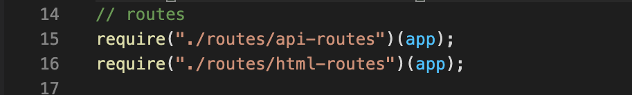
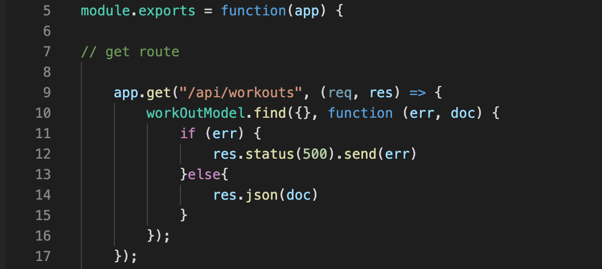

# Fitness App
This app takes in user input such as exercise type, name, sets and reps and calculates workout duration, pounds lifted, and exercises performed.


## Table of Content
- Objective
- Deploy Link
- Getting Started
- Code Highlights
- Technology
- Author 

## Objective
As a user, I want to be able to view create and track daily workouts. I want to be able to log multiple exercises in a workout on a given day. I should also be able to track the name, type, weight, sets, reps, and duration of exercise. If the exercise is a cardio exercise, I should be able to track my distance traveled.

## Deploy Link

https://cryptic-tundra-13999.herokuapp.com/

## Getting Started
These instructions will get you a copy of the project up and running on your local machine for development and testing purposes. See deployment for notes on how to deploy the project on a live system.

```
$ git clone git@github.com:ayladillis/fitness-app.git
ayladillis/fitness-app.git
$ cd ayladillis/fitness-app.git
```
Then open in your preferred text editor:
- [vim](https://www.vim.org/) 
- [emmacs](https://www.gnu.org/software/emacs/)
- [visual studio code](https://code.visualstudio.com/) 

## Code Highlight

Here I linked the api routes in the server.js file 



This code snippet showes the first get route in the routes folder, api-routes.js file that leads to the home page of the fitness app.




## Technology
* [HTML](https://developer.mozilla.org/en-US/docs/Web/HTML)
* [CSS](https://developer.mozilla.org/en-US/docs/Web/CSS)
* [Javascript](https://developer.mozilla.org/en-US/docs/Web/JavaScrip)
* [JQuery](https://jquery.com/)
* [Heroku](https://dashboard.heroku.com/apps)
* [Mongodb](https://www.mongodb.com/)
* [Express](https://expressjs.com/)
* [Mongoose](https://mongoosejs.com/)
* [Sequelize]( )


## Author
### [Ayla Dillis](https://github.com/ayladillis)
- [LinkedIn](https://www.linkedin.com/in/ayladillis/)
- [Portfolio](https://polar-falls-52203.herokuapp.com/)
- [Highlighted-Work](https://ayladillis.github.io/Coding-Bootcamp-Project-1-Zillow-Maps-API-AD/)
- email: aayladillis@gmail.com